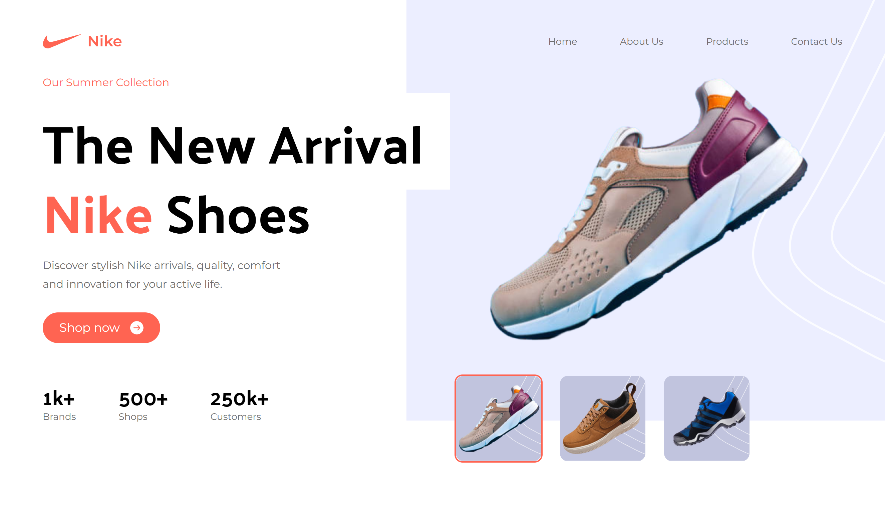

# 👟 Nike Product Landing Page

A clean, responsive **Nike-themed landing page** built with **React** and **Tailwind CSS**. This project was created as part of my journey to master modern CSS utility-first design using Tailwind, inspired by a tutorial by **JavaScript Mastery**.

> 📘 Focused on layout, responsiveness, and visual consistency — not yet a full eCommerce system.

---

## 🚀 Live Demo

[🔗 View Live Site](https://serene-biscotti-6c2764.netlify.app/)

---

## 📸 Preview



---

## 🛠️ Tech Stack

- ⚛️ **React**
- 💨 **Tailwind CSS**
- 🌐 **Vite** (or CRA depending on setup)

---

## ✨ What I Learned

- 📐 Responsive layout design with Tailwind’s utility classes
- 🧩 Component-based structuring with React
- 🎯 Using Flexbox and Grid with Tailwind
- 📱 Designing for mobile-first workflows
- 🎨 Color and spacing management using Tailwind config

---

## 💡 Features

- ✅ Mobile-friendly layout
- 🖼️ Product showcase with image grid
- 🧭 Simple navigation bar
- 🔁 Reusable UI components
- 🎨 Modern, Nike-inspired minimalist styling

---

## 📦 Getting Started

```bash
git clone https://github.com/mostafa-meerzad/nike
cd nike

# Install dependencies
npm install

# Start development server
npm run dev
```

## 🙌 Credits

**JavaScript Mastery** – for the original tutorial

Tailwind CSS – utility-first magic

Nike – for branding inspiration
